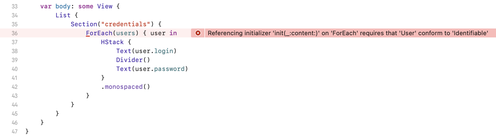

# SwiftUI ForEach Identifiable 

## Problem



How often has this situation happened to you?

```swift
struct User {
    let login: String
    let password: String
}

let users: [User] = [
    .init(login: "root", password: "fh6Cf&Tt"),
    .init(login: "admin", password: "4SB&FNYc"),
    .init(login: "guest", password: "tvsa4Lg,"),
    .init(login: "info", password: "Mk-dAd8D"),
]

var body: some View {
    List {
        Section("credentials") {
            ForEach(users) { user in
                HStack {
                    Text(user.login)
                    Divider()
                    Text(user.password)
                }
                .monospaced()
            }
        }
    }
}
```
    
```swift
Referencing initializer 'init(_:content:)' on 'ForEach' requires that 'User' conform to 'Identifiable'
```

## Solution

```swift
extension Array {
    struct EnumeratedArray<T>: Identifiable {
        let id: Int
        let value: T
    }

    var identifiable: [EnumeratedArray<Element>] {
        enumerated().map { .init(id: $0, value: $1) }
    }
}
```

## Example

```swift
import SwiftUI_Identifiable

var body: some View {
    List {
        Section("credentials") {
            ForEach(users.identifiable) { item in
                let user = item.value

                HStack {
                    Text("#\(item.id)")
                    Divider()
                    Text(user.login)
                    Divider()
                    Text(user.password)
                }
                .monospaced()
            }
        }
    }
}
```

## Installation

#### Swift Package Manager

Add a dependency to your `Package.swift`:

```swift
dependencies: [
    .package(url: "https://github.com/mshershnev/SwiftUI-Identifiable")
]
```

## License

`SwiftUI-Identifiable` is available under the MIT license. See the [LICENSE](LICENSE) file for more info.
